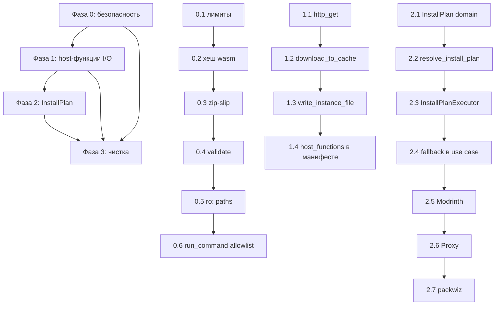

# Аудит архитектуры плагинов Aether (Extism 1.30.0)

> Документ подготовлен по результатам анализа кодовой базы `aether-core` и исходников Extism 1.30.0.
> Все утверждения о поведении Extism проверены по исходному коду тега `v1.30.0`, а не по документации.

---

## 0. Точная версия Extism и что из неё следует

### 0.1. Версия

```toml
# packages/core/aether-core/Cargo.toml
extism = "1.30.0"
extism-convert = "1.30.0"
```

**Используемая версия: `extism` 1.30.0** (host SDK). `extism-pdk` в репозитории не используется вообще — плагины собираются вне этого workspace.

Проверено по crates.io и GitHub releases:

| Факт                            | Значение                        |
| ------------------------------- | ------------------------------- |
| Последняя опубликованная версия | **1.30.0** (2026-06-04)         |
| Предыдущая                      | 1.21.0 (2026-03-26)             |
| `main` / dev build              | wasmtime 48 (LTS), **не релиз** |
| Runtime в 1.30.0                | **wasmtime 43**                 |
| Лицензия / edition              | BSD-3-Clause / 2021             |

**Вывод: вы уже на последней версии.** «Изменений между вашей версией и текущей последней» не существует — 1.30.0 и есть последняя. Единственное, что есть «впереди» — dev-ветка с wasmtime 48, но она не опубликована и не является целью миграции.

Это важно для планирования: **любые архитектурные решения можно принимать без оглядки на «а вдруг в новой версии будет иначе»**. Всё, что описано ниже, — это ограничения 1.30.0, и они не изменятся от простого `cargo update`.

### 0.2. Что реально умеет 1.30.0 (проверено по исходникам, не по докам)

Это критично, потому что часть ваших предположений о возможностях Extism неверна.

**`allowed_hosts` — это НЕ сетевой sandbox.**

```rust
// runtime/src/pdk.rs, fn http_request
let allowed_hosts = &data.manifest.allowed_hosts;
let host_str = url.host_str().unwrap_or_default();
let host_matches = if let Some(allowed_hosts) = allowed_hosts {
    allowed_hosts.iter().any(|url| {
        let pat = match glob::Pattern::new(url) { Ok(x) => x, Err(_) => return url == host_str };
        pat.matches(host_str)
    })
} else { false };

if !host_matches {
    return Err(Error::msg(format!("HTTP request to {} is not allowed", req.url)));
}
```

`allowed_hosts` проверяется **только внутри `extism:host/env::http_request`** — встроенной host-функции Extism. Она не имеет никакого отношения к WASI. Если плагин делает сетевые запросы через WASI-сокеты, `allowed_hosts` не применяется вообще.

**Но:** WASI-контекст в 1.30.0 создаётся так:

```rust
// runtime/src/current_plugin.rs, CurrentPlugin::new
let ctx = wasi_common::WasiCtx::new(random, clocks, sched, table);
if let Some(a) = &manifest.allowed_paths {
    for (k, v) in a.iter() {
        let readonly = k.starts_with("ro:");
        let dir_path = if readonly { &k[3..] } else { k };
        ...
    }
}
```

`inherit_network` не вызывается, `socket_addr_check` не настраивается. То есть **WASI p1 sockets в Extism 1.30.0 фактически не подключены** — плагин не может открыть TCP-соединение через WASI. Единственный сетевой путь — `http_request`.

Это меняет картину: **у вас уже есть сетевой sandbox, просто вы им не пользуетесь.** Плагины, которым нужен HTTP, должны идти через `http_request` (или через вашу host-функцию), а не через WASI. Если сейчас какой-то плагин «сам делает HTTP через WASI» — он либо не работает, либо использует что-то ещё.

**`allowed_paths` поддерживает read-only монтирование:**

```rust
let readonly = k.starts_with("ro:");
```

Ключ `"ro:/path/on/host"` монтируется как read-only. Это недокументированная в основных доках, но работающая фича 1.30.0. Для вашего кейса (плагин читает `pack.toml`, но не пишет в инстанс) это ровно то, что нужно.

**`Manifest::new()` по умолчанию запрещает весь HTTP:**

```rust
pub fn new(wasm: impl IntoIterator<Item = impl Into<Wasm>>) -> Manifest {
    Manifest { wasm: ..., ..Default::default() }
}
// allowed_hosts: Option<Vec<String>> = None
// → host_matches = false → любой http_request падает
```

У вас `with_allowed_hosts(allowed_hosts.into_iter())` вызывается всегда, даже если вектор пустой → `Some(vec![])` → тоже запрет. Это корректно, но означает: **если вы добавите host-функцию `http_fetch`, она должна проверять `allowed_hosts` сама** — Extism этого за вас не сделает.

**`Plugin::call` синхронный и не поддерживает реентрантность:**

```rust
let mut lock = lock.try_lock().map_err(|e| match e {
    TryLockError::Poisoned(_) => anyhow::anyhow!("instance lock was poisoned; ..."),
    TryLockError::WouldBlock => anyhow::anyhow!("cannot make reentrant calls into plugin"),
})?;
```

Это значит: **host-функция не может вызвать другой метод того же плагина.** Если вы захотите, чтобы `install_modpack` внутри плагина дёргал `search` того же плагина — это упадёт. Для «плагин A переиспользует логику плагина B» это не проблема (разные `Plugin`), но для внутренней декомпозиции — да.

**`function_exists` — очень узкая проверка:**

```rust
pub fn function_exists(&self, function: impl AsRef<str>) -> bool {
    self.modules[MAIN_KEY].get_export(function.as_ref()).map(|x| {
        if let Some(f) = x.func() {
            let (params, mut results) = (f.params(), f.results());
            match (params.len(), results.len()) {
                (0, 1) => matches!(results.next(), Some(wasmtime::ValType::I32)),
                (0, 0) => true,
                _ => false,
            }
        } else { false }
    }).unwrap_or(false)
}
```

`supports()` в вашем `ExtismPluginInstance` делегирует сюда. Это работает для Extism-плагинов (у них экспорт — `() -> i32`), но **не работает для `LoadConfig::Native`** и не даёт никакой информации о _сигнатуре_ функции. То есть `supports("install_atomic")` вернёт `true` даже если плагин экспортирует функцию с тем же именем, но другим контрактом.

**Есть `call_get_error_code`, `fuel_consumed`, `cancel_handle`, `has_wasi`** — всё это доступно в 1.30.0 и не используется у вас.

**`http_request` не следует редиректам** (ureq по умолчанию) и имеет лимит ответа 50 MiB по умолчанию (`max_http_response_bytes` настраивается). Таймаут `http_request` = `data.time_remaining()`, то есть привязан к `manifest.timeout_ms`.

---

## 1. Независимый аудит архитектуры

Ниже — находки, которые вы не называли. Я группирую их по серьёзности.

### 1.1. Критичные

#### A1. `run_command` — произвольное исполнение кода без каких-либо ограничений

```rust
// host_functions/features/core.rs
pub(crate) async fn handle_run_command(
    plugin_id: &str,
    command: CommandDto,
    container: &AetherContainer,
) -> crate::Result<OutputDto> {
    let host_command = plugin_utils::plugin_command_to_host(plugin_id, &command, &container.location_info())?;
    let mut cmd = host_command.to_tokio_command();
    let output = cmd.output().await...
}
```

И в `plugin_utils.rs`:

```rust
let resolved_program = plugin_path_to_host(id, &command.program, location_info).map_or_else(
    |_| command.program.clone(),   // ← fallback на сырую строку
    |p| p.to_string_lossy().to_string(),
);
```

Что здесь не так:

1. **Нет allowlist программ.** Плагин может вызвать `cmd.exe /c ...`, `powershell -enc ...`, `sh -c ...`, `curl`, `rm -rf`, что угодно.
2. **Fallback на сырую строку.** Если `plugin_path_to_host` не смог разрешить путь (например, программа не начинается с `#`), берётся `command.program` как есть. То есть проверка путей — это не барьер, а «если получилось — подставим путь».
3. **Нет подтверждения пользователя.** Плагин, установленный из GitHub-релиза, получает RCE на машине пользователя без единого диалога.
4. **Нет ограничения по времени.** `cmd.output().await` без таймаута — плагин может запустить процесс, который висит вечно, и заблокировать tokio-воркер (см. A2).
5. **Нет ограничения на вывод.** `OutputDto { stdout: Vec<u8>, stderr: Vec<u8> }` — процесс может выдать гигабайты, всё это уедет в WASM-память плагина и, возможно, в лог.
6. **`current_dir` тоже резолвится через `plugin_path_to_host`**, но с тем же fallback-паттерном.

Это самая серьёзная дыра в модели прав. `run_command` — это не «host-функция для удобства», это «полный доступ к ОС». Если packwiz-плагин запускает `java -jar packwiz-installer.jar`, то ровно ту же функцию может вызвать любой другой плагин и запустить `java -jar <что-угодно>` или вообще не java.

**Почему это важно:** модель прав плагина в остальных местах построена вокруг «плагин ограничен WASI-путями и allowed_hosts». `run_command` полностью обходит эту модель. Аудировать «какие файлы записал плагин» бессмысленно, если плагин может запустить процесс, который запишет что угодно куда угодно.

#### A2. `execute_async` блокирует tokio-воркер на всё время вызова плагина

```rust
// shared/execute_async/infra/mod.rs
pub fn execute_async<F: Future>(future: F) -> F::Output {
    match tokio::runtime::Handle::try_current() {
        Ok(handle) => tokio::task::block_in_place(|| handle.block_on(future)),
        _ => tokio::runtime::Runtime::new().expect("Failed to create runtime").block_on(future),
    }
}
```

Каждая host-функция (`run_command`, `instance_create`, `list_content`, `get_java`, `install_java`, …) вызывает `execute_async`. `block_in_place` переводит текущий воркер в blocking-режим и **создаёт/переиспользует другой поток** для остальных задач. При этом:

- `block_in_place` **паникует**, если runtime — current-thread. У вас `tokio` с `features = ["full"]`, но Tauri может создавать current-thread runtime в некоторых конфигурациях.
- Ветка `_ => Runtime::new()` создаёт **новый runtime на каждый вызов** host-функции, если вызова нет внутри tokio-контекста. Это дорого и потенциально опасно (вложенные runtime).
- Пока плагин выполняет `install_modpack` (минуты), один tokio-воркер занят целиком. При нескольких параллельных установках воркеры кончаются.

**Почему это важно:** это не «мелкая оптимизация». Это архитектурный дефект границы: синхронный `Plugin::call` (таков Extism 1.30.0) вынуждает блокировать async-рантайм. Правильное решение — выносить вызов плагина в `spawn_blocking` на уровне _вызывающего_, а не блокировать воркер внутри host-функции.

#### A3. `memory_limit` из манифеста парсится и игнорируется

```rust
// domain/models/plugin_manifest.rs
Extism {
    file: PathBuf,
    memory_limit: Option<usize>,
},
```

```rust
// extism_plugin_loader.rs — build_plugin
let mut builder = PluginBuilder::new(wasm_manifest)
    .with_functions(get_host_functions(plugin_id, container))
    .with_wasi(true);
if let Some(cache_dir) = cache_dir {
    builder = builder.with_cache_config(cache_dir);
}
builder.build()
```

`memory_limit` не передаётся никуда. `PluginBuilder::with_memory_max(u32)` в 1.30.0 существует и не используется. То есть **плагин может аллоцировать неограниченную память** (в пределах wasmtime-дефолтов) и уронить лаунчер по OOM.

Аналогично не используются:

- `Manifest::with_timeout(Duration)` — плагин может висеть бесконечно (в комбинации с A2 это ещё и блокирует воркер навсегда);
- `PluginBuilder::with_fuel_limit(u64)` — нет ограничения на количество инструкций;
- `Wasm::with_hash(...)` — **wasm-файл не проверяется по хешу** при загрузке.

#### A4. `Wasm::file()` без хеша — нет проверки целостности плагина

```rust
let wasm_file = Wasm::file(self.resolve_absolute_wasm_path(&manifest.metadata.id, wasm_file_path));
```

`WasmMetadata::hash` в 1.30.0 поддерживается:

```rust
/// Module hash, if the data loaded from disk or via HTTP doesn't match an error will be raised
pub hash: Option<String>,
```

У вас хеш не задаётся. При этом плагины скачиваются из GitHub-релизов (`github_plugin/fetcher.rs::download_asset`) и распаковываются (`ZipPluginExtractor`). Проверки подписи/хеша скачанного архива нет — ни в `download_asset`, ни в `extractor.rs`.

**Почему это важно:** цепочка «скачали zip с GitHub → распаковали → загрузили wasm» не имеет ни одной точки верификации. Компрометация GitHub-аккаунта автора плагина или MITM (если бы не HTTPS) даёт RCE через A1.

#### A5. `ZipPluginExtractor` использует `archive.extract()` без защиты от zip-slip

```rust
let temp_dir = TempDir::new().map_err(IoError::from)?;
archive.extract(&temp_dir)
    .map_err(|_| PluginError::FileExtractionFailed { from: source_path })?;
```

`zip` crate 8.x: `ZipArchive::extract` **не** защищает от `../` в именах записей (в отличие от `enclosed_name()`). Плагин-архив с записью `../../../../evil.wasm` запишет файл за пределами `temp_dir`.

**Почему это важно:** это классический zip-slip, и он здесь в самом начале цепочки доверия — до того, как плагин вообще загружен и ограничен WASI. Эксплуатация не требует запуска wasm.

#### A6. `api.features` в манифесте не проверяется вообще

```rust
pub struct ApiConfig {
    pub version: semver::VersionReq,
    pub features: Vec<String>,
}
```

`features` парсится, конвертируется в DTO и обратно, но **нигде не читается**. Плагин может объявить `"features": ["network", "filesystem"]` — это ни на что не влияет. И наоборот: плагин может не объявить ничего и всё равно получить все host-функции.

**Почему это важно:** это заявленный, но не работающий механизм capability-декларации. Он создаёт ложное чувство безопасности и при этом не даёт никакой пользы. Либо его надо реализовать, либо удалить из схемы (иначе он вводит в заблуждение и авторов плагинов, и аудиторов).

#### A7. `manifest.validate()` не вызывается при загрузке

```rust
impl PluginManifest {
    pub fn validate(&self, api_version: &semver::Version) -> Result<(), ManifestError> {
        self.runtime.validate()?;
        self.api.validate(api_version)?;
        Ok(())
    }
}
```

Grep по репозиторию: `manifest.validate(...)` встречается **только в тестах** (`plugin_manifest.rs:286,316,345`). В `EnablePluginUseCase` вызывается только `manifest.api.check_compatibility(...)`, а `runtime.validate()` (проверка, что `allowed_paths` не абсолютные) — никогда.

**Почему это важно:** `RuntimeConfig::validate` проверяет, что host-путь в `allowed_paths` не абсолютный. Это единственная защита от того, чтобы плагин через манифест смонтировал себе `C:\` или `/`. Она не работает.

#### A8. Дефолтные allowed_paths дают плагину доступ ко ВСЕМ инстансам

```rust
pub fn get_default_allowed_paths(location_info: &LocationInfo, plugin_id: &str) -> HashMap<String, PathBuf> {
    HashMap::from([
        (location_info.plugin_cache_dir(plugin_id).to_string_lossy().to_string(), PathBuf::from("/cache")),
        (location_info.instances_dir().to_string_lossy().to_string(), PathBuf::from("/instances")),
    ])
}
```

`instances_dir()` — это **корень всех инстансов**. Плагин получает `/instances` и может читать/писать в любой инстанс, включая те, к которым он не имеет отношения. Плюс `ensure_default_allowed_paths` создаёт эти директории при загрузке плагина.

**Почему это важно:** это прямо противоречит вашей проблеме №1. Вы говорите «сложно аудировать, какие файлы были записаны» — но проблема глубже: плагин _по дизайну_ имеет доступ ко всем инстансам. Аудит тут не поможет, потому что легитимный доступ слишком широк.

#### A9. `plugin_path_to_host` — TOCTOU между canonicalize и использованием

```rust
let canonical_base = crate::shared::io::infra::canonicalize(base_dir)?;
let canonical_host = crate::shared::io::infra::canonicalize(&host_path)?;

if !canonical_host.starts_with(&canonical_base) {
    return Err(PluginError::AccessViolation { ... });
}

Ok(host_path)   // ← возвращается НЕ canonical путь
```

Проверка делается по canonical-пути, а возвращается исходный `host_path`. Между проверкой и использованием файла может быть подменён симлинк. Плюс `canonicalize` требует существования пути — для несуществующего файла (типичный случай при записи) `canonicalize` упадёт, и функция вернёт ошибку, которая в `plugin_command_to_host` **молча проглатывается** через `map_or_else`.

**Почему это важно:** это не «теоретический TOCTOU» — это ещё и функциональный баг: `run_command` с путём к несуществующему файлу не получит `AccessViolation`, а получит сырую строку.

### 1.2. Существенные

#### A10. Нет версионирования контракта host-функций

`PLUGIN_API_VERSION` берётся из версии `aether-core-plugin-api` (сейчас `0.2.0`). Проверяется только `manifest.api.version` (semver req) против этой версии. Но:

- **Набор host-функций не версионируется.** Если вы добавите `http_fetch` в 0.3.0, старый плагин, собранный под 0.2.0, продолжит работать — но новый плагин под 0.3.0, использующий `http_fetch`, при загрузке в старом лаунчере получит ошибку линковки wasm («unknown import»), а не внятное «требуется API 0.3».
- **`capabilities.json` не имеет поля версии.** `PluginCapabilitiesV1` — это «V1» в имени типа, но в самом файле нет `version`. Схема `PluginCapabilitiesDto` имеет `deny_unknown_fields`, то есть добавление поля в capabilities сломает старые лаунчеры с невнятной ошибкой парсинга.
- **`force_enabled_at_api_version`** сравнивается со строкой `PLUGIN_API_VERSION.to_string()`. Если API-версия меняется с 0.2.0 на 0.2.1 (patch), флаг сбрасывается и пользователь должен заново подтверждать. Это, вероятно, не то, что задумано.

**Почему это важно:** у вас есть механизм версионирования, но он покрывает только «версию API», а не «версию контракта host-функций» и не «версию формата capabilities». Это три разные вещи, и они смешаны в одну.

#### A11. Ошибки на границе WASM теряют структуру

```rust
fn call_bytes<'b>(&'b mut self, name: &str, args: &[u8]) -> Result<&'b [u8], PluginError> {
    self.inner.call(name, args).map_err(|e| PluginError::FunctionCallFailed {
        function_name: name.to_owned(),
        plugin_id: self.id.clone(),
        error: e.to_string(),   // ← всё схлопывается в String
    })
}
```

Extism различает:

- ошибку линковки/инстанцирования,
- trap (паника в wasm, OOM, out-of-fuel),
- таймаут (`Error::msg("timeout")`),
- WASI exit code (`wasi_common::I32Exit`),
- «Returned non-zero exit code: {rc}»,
- ошибку, установленную плагином через `extism:host/env::error_set`.

Всё это превращается в одну строку. На стороне ядра (`PluginContentProviderProxy::call_plugin`) — в `InstanceError::ContentProviderError { reason: err.to_string() }`. Дальше — в `FrontendErrorDto`.

**Почему это важно:** невозможно отличить «плагин вернул бизнес-ошибку» от «плагин упал по таймауту» от «плагин не слинковался». Для UX это критично: таймаут надо показывать как «превышено время», а не как «ошибка провайдера». Для ретраев — тоже: trap не ретраится, сетевая ошибка ретраится.

Отдельно: `HostResult<T>` / `HostError` — это **хороший** механизм (структурированные ошибки через Msgpack), но он работает только для host-функций (host → plugin). Для plugin → host (возврат из `install_atomic`) структурированной ошибки нет: плагин либо возвращает `Ok`, либо падает.

#### A12. `PluginInstance` — слишком узкий трейт, `PluginInstanceExt` — в infra

```rust
pub trait PluginInstance: Send + Sync {
    fn get_id(&self) -> String;
    fn supports(&self, name: &str) -> bool;
    fn call_bytes<'b>(&'b mut self, name: &str, args: &[u8]) -> Result<&'b [u8], PluginError>;
    fn handle_event(&mut self, event: &PluginInternalEvent) -> Result<(), PluginError>;
}
```

Проблемы:

- `get_id(&self) -> String` — аллокация на каждый вызов, при том что `id` — это `String` в `ExtismPluginInstance`. Мелочь, но в горячем пути.
- `call_bytes` возвращает `&'b [u8]`, заимствованный из `&'b mut self`. Это значит, что **нельзя одновременно держать результат и вызывать плагин снова** — и это правильно, но неявно. Комментарий в Extism: «This data will be invalidated next time the plugin is called». Тип это выражает, но `PluginInstanceExt::call` сразу конвертирует в owned `U`, так что на уровне `PluginInstanceExt` ограничение исчезает — и это опасно, если кто-то будет хранить `&[u8]`.
- `supports()` для `LoadConfig::Native` не имеет смысла (см. A13).
- Нет метода для отмены (`cancel_handle`), нет `fuel_consumed`, нет `has_wasi`.

#### A13. `LoadConfig::Native` — заявлен, но не реализован, и это дыра в модели безопасности

```rust
pub enum LoadConfig {
    Extism { file: PathBuf, memory_limit: Option<usize> },
    Native { lib_path: PathBuf },
}
```

`PluginLoaderRegistry` — это `HashMap<LoadConfigType, Arc<dyn PluginLoader>>`. В `apps/desktop/src/core/app/container.rs` регистрируется только `ExtismPluginLoader`. `LoadConfigType::Native` в реестре отсутствует → `PluginError::LoaderNotFound`.

Но: **`LoadConfig::Native` присутствует в публичной схеме манифеста** (`LoadConfigDto::Native`), то есть автор плагина может его указать. И `ExtismPluginLoader::build_wasm_manifest` явно возвращает `PluginError::InvalidConfig` для `Native`.

**Почему это важно:** наличие `Native` в схеме — это обещание, что нативная загрузка возможна. Если она когда-нибудь появится, это будет **полный обход всей модели sandbox** (никакого WASI, никаких allowed_paths, никакого allowed_hosts). Сейчас это «мёртвая ветка», но она в схеме, в DTO, в мапперах, в `LoadConfigType`, в `PluginLoaderRegistry`. Это архитектурный долг, который лучше закрыть явно (удалить или задокументировать как «не поддерживается и не будет»).

#### A14. `PluginContentProviderProxy` держит `Arc<Mutex<dyn PluginInstance>>` и сериализует все вызовы

```rust
async fn call_plugin<I, O>(&self, handler_name: &str, input: I) -> Result<O, InstanceError> {
    let mut plugin = self.instance.lock().await;
    ...
    plugin.call::<Msgpack<I>, Msgpack<O>>(handler_name, Msgpack(input))
}
```

`plugin.call` — синхронный (Extism 1.30.0). Он вызывается **внутри async-функции, держа async-мьютекс**. То есть:

1. `tokio::sync::Mutex` удерживается на всё время синхронного вызова плагина.
2. Синхронный вызов блокирует tokio-воркер (см. A2 — но здесь даже без `block_in_place`, просто прямой блокирующий вызов внутри async-контекста).
3. Все операции с одним плагином сериализуются. Для `search` + `install` параллельно — это ок (плагин всё равно один инстанс), но для «показать прогресс во время установки» — нет, потому что `search` будет ждать `install`.

**Почему это важно:** это скрытая причина, по которой «прогресс через WASM» не работает. Пока `install_modpack` держит мьютекс, никакой другой вызов плагина невозможен. И `block_in_place` внутри host-функции (A2) усугубляет: воркер занят, мьютекс занят, всё ждёт.

#### A15. `PluginRegistry` / `PluginLoaderRegistry` — `HashMap` без версионирования и без capability-проверок

```rust
pub struct PluginLoaderRegistry {
    loaders: HashMap<LoadConfigType, Arc<dyn PluginLoader>>,
}
```

`register` / `unregister` — публичные, без проверок. `get` возвращает `&Arc<dyn PluginLoader>` — заимствование из `HashMap`, что означает, что реестр нельзя мутировать, пока держишь ссылку. Это ок, но означает, что «горячая замена лоадера» невозможна без пересоздания реестра.

Более важно: **нет проверки, что плагин, объявивший capability, действительно экспортирует соответствующий handler.** `PluginContentProviderProxy::call_plugin` проверяет `plugin.supports(handler_name)` в рантайме и логирует ошибку. Но `capabilities.json` — это декларация, которая не валидируется при загрузке. То есть UI покажет «провайдер поддерживает установку модпаков», а при клике будет ошибка.

#### A16. `PluginInternalEvent` — только 4 события, нет версионирования, нет ошибок

```rust
pub enum PluginInternalEventDto {
    Loaded,
    Unloaded,
    BeforeInstanceLaunch { instance_id: String },
    AfterInstanceLaunch { instance_id: String },
}
```

`handle_event` вызывается в `ExtismPluginInstance::handle_event`, и ошибки **логируются и проглатываются**:

```rust
if let Err(err) = plugin.handle_event(&PluginInternalEvent::Loaded) {
    tracing::debug!("Failed to call on_load on plugin {}: {:?}", plugin.get_id(), err);
}
```

**Почему это важно:** `BeforeInstanceLaunch` — это хук, который может модифицировать инстанс перед запуском (например, packwiz-плагин может досинхронизировать модпак). Если он падает, запуск продолжается. Это может привести к запуску инстанса в неконсистентном состоянии. Для `Loaded`/`Unloaded` проглатывание ок, для `BeforeInstanceLaunch` — нет.

#### A17. `PluginSettings` — `allowed_hosts` и `allowed_paths` мержатся без дедупликации и без валидации

```rust
fn resolve_allowed_paths(...) -> (Vec<String>, Vec<PathMapping>) {
    let mut allowed_hosts = manifest.runtime.allowed_hosts.clone();
    let mut allowed_paths = manifest.runtime.allowed_paths.clone();
    if let Some(default_allowed_paths) = default_allowed_paths {
        allowed_paths.extend(default_allowed_paths.iter().map(|(k, v)| PathMapping(k.clone(), v.clone())));
    }
    if let Some(settings) = settings {
        allowed_hosts.extend_from_slice(&settings.allowed_hosts);
        allowed_paths.extend_from_slice(&settings.allowed_paths);
    }
    (allowed_hosts, allowed_paths)
}
```

`allowed_paths` — это `Vec<PathMapping>`, который конвертируется в `BTreeMap<String, PathBuf>` через `.map(Into::into)`. Если два маппинга имеют одинаковый host-путь, **последний выигрывает** (BTreeMap insert). Порядок: manifest → defaults → settings. То есть **пользовательские настройки переопределяют дефолты** — это правильно. Но:

- Нет проверки, что пользователь не добавил `C:\` (в `EditPluginSettingsUseCase` есть проверка `PathBuf::from(host).exists()`, но не проверка на абсолютность/опасность).
- `RuntimeConfig::validate` (проверка на абсолютность) не вызывается (A7).
- `allowed_hosts` — `Vec<String>`, дубликаты не удаляются, wildcard-паттерны не валидируются (невалидный glob в Extism молча превращается в точное сравнение: `Err(_) => return url == host_str`).

#### A18. `to_wasi_path` / `from_wasi_path` — самодельная трансляция путей, хрупкая

```rust
pub fn to_wasi_path(input: &str) -> String {
    let path = input.replace('\\', "/");
    let path = if path.len() >= 2 && path.as_bytes()[1] == b':' && ... {
        let drive_letter = path.as_bytes()[0].to_ascii_lowercase() as char;
        let rest = if path.len() > 3 { &path[3..] } else { "" };
        format!("/mnt/{drive_letter}/{rest}")
    } else { path };
    ...
}
```

Проблемы:

- `path.as_bytes()[0]` — байтовый доступ к `str`. Для не-ASCII первого символа это может дать неверный результат (хотя `len() >= 2` и `[1] == b':'` отсекают большинство).
- `&path[3..]` — срез по байтам, может паниковать на не-ASCII границе (маловероятно для drive-letter паттерна, но всё же).
- `from_wasi_path` на не-Windows возвращает путь как есть, но `to_wasi_path` на не-Windows тоже не трогает `/mnt/...` — то есть на Linux путь `/mnt/d/foo` останется `/mnt/d/foo`, а на Windows он же превратится в `D:\foo`. **Асимметрия.**
- `plugin_importer_proxy.rs` вызывает `to_wasi_path(path)` для пути, который пришёл от пользователя (путь к `pack.toml`). Это путь **на хосте**, и он конвертируется в WASI-путь, чтобы плагин мог его открыть. Но плагин получает его как строку и должен сам понять, что это WASI-путь. Если плагин написан на Rust с `std::fs`, он откроет `/mnt/d/...` — и это сработает только если `allowed_paths` содержит маппинг, покрывающий этот путь. А `allowed_paths` по умолчанию — только `/cache` и `/instances`. То есть **импорт инстанса из произвольного пути не сработает**, если пользователь не добавит путь в настройки плагина.

**Почему это важно:** это скрытая связка «UI-настройки плагина → allowed_paths → WASI-путь → плагин». Она не выражена в типах и легко ломается.

#### A19. `PluginError` смешивает слои

```rust
pub enum PluginError {
    NotFound { plugin_id: String },
    LoadFailed { plugin_id: String, reason: String },
    FunctionCallFailed { function_name: String, plugin_id: String, error: String },
    AccessViolation { plugin_id: String, path: String },
    ProviderFetchError { source_type: PluginSourceType, details: String },
    ProviderRateLimited { source_type: PluginSourceType, retry_after: Option<u32> },
    DownloadFailed { url: String, details: String },
    ...
}
```

Здесь смешаны:

- ошибки жизненного цикла плагина (`NotFound`, `AlreadyLoaded`, `LoadingInProgress`),
- ошибки исполнения (`FunctionCallFailed`),
- ошибки безопасности (`AccessViolation`),
- ошибки **провайдера плагинов** (`ProviderFetchError`, `ProviderRateLimited`, `DownloadFailed`) — то есть ошибки скачивания плагина из GitHub.

Последняя группа — это не про плагины, а про `PluginProvider` (источник плагинов). Это разные bounded context'ы. `PluginError::DownloadFailed` не должен быть в том же enum, что `PluginError::FunctionCallFailed`.

**Почему это важно:** это нарушает ваш же `ARCHITECTURE.md` (границы слоёв). И это приводит к тому, что `FrontendErrorDto` для плагинов содержит варианты, которые не имеют смысла в контексте исполнения плагина.

#### A20. `PluginManifestDto` использует `deny_unknown_fields`, но `PluginSettingsV1` — нет

```rust
#[derive(Debug, Clone, Serialize, Deserialize, PartialEq, JsonSchema)]
#[serde(rename_all = "camelCase")]
#[schemars(deny_unknown_fields)]
pub struct PluginManifestDto { ... }
```

vs

```rust
#[derive(Debug, Clone, Serialize, Deserialize)]
#[serde(rename_all = "camelCase")]
pub struct PluginSettingsV1 {
    pub allowed_hosts: Vec<String>,
    pub allowed_paths: Vec<(String, String)>,
    #[serde(default)]
    pub force_enabled_at_api_version: Option<String>,
}
```

`PluginSettingsV1` — это **внутренний** формат (`settings.toml`), и отсутствие `deny_unknown_fields` там правильно (forward-compat). Но `PluginCapabilitiesV1` (тоже внутренний, `capabilities.json`) — тоже без `deny_unknown_fields`, а `PluginCapabilitiesDto` (публичная схема) — с ним. Это несогласованность: публичная схема строже внутренней.

Более важно: **`PluginSettingsV1.allowed_paths` — это `Vec<(String, String)>`**, а `PluginManifestDto.runtime.allowed_paths` — `Vec<PathMappingDto>` (tuple struct). Два разных представления одного и того же. Плюс `fs_plugin_settings_storage.rs` конвертирует host-путь через `to_wasi_path` при записи:

```rust
allowed_paths: settings.allowed_paths.iter()
    .map(|pm| (pm.0.clone(), to_wasi_path(&pm.1.to_string_lossy())))
    .collect(),
```

То есть в `settings.toml` **host-путь хранится как WASI-путь**. Это очень запутанно: `PathMapping(host, virtual)` в domain, но при сериализации `virtual` конвертируется через `to_wasi_path` (который предназначен для конвертации _host_ путей в WASI). Это выглядит как баг: `to_wasi_path` применяется к `virtual`-пути, который и так уже WASI-подобный (`/cache`, `/instances`).

### 1.3. Мелкие, но стоит знать

- **A21.** `PluginContext` хранит `Weak<AetherContainer>`, и каждая host-функция делает `upgrade_container().ok_or_else(...)`. Если контейнер дропнут, плагин получит `anyhow::Error::msg("AetherContainer dropped before plugin call")` — невнятная ошибка.
- **A22.** `PluginContext` оборачивается в `Arc<Mutex<...>>` (судя по `context.lock()`), и каждая host-функция лочит его, клонирует `id`, апгрейдит контейнер, и **дропает лок** перед `execute_async`. Это правильно (иначе дедлок), но `id.clone()` на каждый вызов — лишняя аллокация.
- **A23.** `get_host_functions` создаёт `PluginContext` один раз и клонирует его в `UserData::new(context.clone())` для каждой функции. `UserData` требует `Send + Sync` (в 1.20.0 это стало breaking change для Pool). У вас `PluginContext` содержит `Weak<AetherContainer>` — `Weak` это `Send + Sync` только если `T: Send + Sync`. `AetherContainer` должен быть `Send + Sync` — судя по `Arc<AetherContainer>` в DI, да.
- **A24.** `ExtismPluginInstance` не реализует `Drop` для вызова `on_unload` — это делается явно в `PluginLoader::unload`. Если плагин выгружается не через `unload` (например, при дропе реестра), `on_unload` не вызовется.
- **A25.** `wasm_cache.rs` пишет `cleanup_interval: "30m"` и `files_total_size_soft_limit: "1Gi"` — но `WasmCacheConfig` не имеет `#[serde(deny_unknown_fields)]`, а комментарий говорит, что wasmtime's `CacheConfig` его имеет. Если wasmtime 43 изменит поля, ошибка будет невнятной.
- **A26.** `PluginContentProviderProxy::install_modpack` возвращает `(String, Vec<ContentFile>)` — кортеж. Это неименованный контракт: что такое `String`? `instance_id`. Это должно быть структурой.
- **A27.** `check_compatibility` в `ContentProvider` принимает `&[Instance]` — то есть ядро передаёт плагину **полные доменные объекты инстансов** (через DTO). Это утечка данных: плагину для проверки совместимости нужны только `game_version` и `mod_loader`, а он получает всё.
- **A28.** `list_content` возвращает `DashMap<String, ContentFileDto>` — `DashMap` сериализуется через serde (feature `serde` включён). Это работает, но `DashMap` — это конкурентная структура, и её сериализация в Msgpack недетерминирована по порядку. Для плагина это неважно, но для тестов — да.

---

## 2. Анализ проблем 1–4 с альтернативами

### Проблема 1: широкий доступ плагина к ФС через WASI, сложно аудировать

#### Вариант 1A: сузить `allowed_paths` до per-instance + read-only для входных данных

**Идея:** вместо `/instances` (все инстансы) монтировать только тот инстанс, с которым работает плагин, и монтировать его read-only, если плагин только читает.

```rust
// plugin_utils.rs
pub fn get_default_allowed_paths(
    location_info: &LocationInfo,
    plugin_id: &str,
    instance_id: Option<&str>,   // ← новое
) -> HashMap<String, PathBuf> {
    let mut paths = HashMap::from([
        (location_info.plugin_cache_dir(plugin_id).to_string_lossy().to_string(),
         PathBuf::from("/cache")),
    ]);

    if let Some(instance_id) = instance_id {
        // ro: префикс — read-only монтирование (поддерживается Extism 1.30.0)
        paths.insert(
            format!("ro:{}", location_info.instance_dir(instance_id).to_string_lossy()),
            PathBuf::from("/instance"),
        );
    }

    paths
}
```

Проблема: `allowed_paths` задаются **при загрузке плагина**, а `instance_id` известен только при вызове. Extism 1.30.0 не позволяет менять `allowed_paths` после `PluginBuilder::build()`.

**Обходные пути:**

- (a) Монтировать `instances_dir` как раньше, но **не давать плагину писать** — то есть `ro:` на весь `instances_dir`, а запись только через host-функции. Это решает проблему аудита (плагин физически не может писать), но не решает проблему чтения чужих инстансов.
- (b) Пересоздавать `Plugin` при смене инстанса. Дорого (компиляция wasm), но с `with_cache_config` компиляция кэшируется, так что пересоздание — это в основном инстанцирование. Всё равно дорого для каждого вызова.
- (c) Использовать `Pool` (появился в 1.12.0) — но `Pool` тоже не позволяет менять manifest per-checkout.

**Trade-offs:**

|                           | Плюсы                                       | Минусы                                                                               |
| ------------------------- | ------------------------------------------- | ------------------------------------------------------------------------------------ |
| 1A(a) ro: на instances    | Просто, работает в 1.30.0, закрывает запись | Плагин всё ещё читает все инстансы; ломает плагины, которые пишут в инстанс напрямую |
| 1A(b) пересоздание Plugin | Точный per-instance доступ                  | Дорого; усложняет жизненный цикл; ломает `on_load`/`on_unload` семантику             |
| 1A(c) Pool                | Параллелизм                                 | Не решает per-instance; Pool в 1.20.0 имел breaking change по `UserData`             |

#### Вариант 1B: убрать WASI полностью, весь I/O — через host-функции

**Идея:** `with_wasi(false)`. Плагин не имеет ФС вообще. Всё, что ему нужно, — через host-функции: `read_file`, `write_file`, `list_dir`, `download`.

**Trade-offs:**

| Плюсы                                                                                             | Минусы                                                                               |
| ------------------------------------------------------------------------------------------------- | ------------------------------------------------------------------------------------ |
| Полный аудит: каждая операция ФС проходит через хост, логируется, может быть ограничена политикой | Ломает все существующие плагины (breaking)                                           |
| Нет zip-slip-подобных проблем на стороне плагина                                                  | Нужно реализовать host-функции для всех операций (read/write/list/stat/mkdir/remove) |
| Работает одинаково на всех платформах (нет `/mnt/d/...` хака)                                     | Плагин не может использовать `std::fs` — нужен PDK-слой                              |
| Позволяет per-call политику (instance_id известен в момент вызова)                                | Больше кода на границе; сериализация больших файлов через Msgpack дорогая            |

**Ключевое преимущество:** per-call политика. Host-функция `read_file(instance_id, path)` знает `instance_id` и может проверить, что плагин имеет право на этот инстанс. С WASI это невозможно без пересоздания плагина.

**Ключевой минус:** производительность. Передача файла через Msgpack (host → plugin) означает копирование в WASM-память. Для мода на 50 МБ это 50 МБ копирования + сериализация. Для чтения `pack.toml` — неважно.

#### Вариант 1C: гибрид — WASI read-only + host-функции для записи

**Идея:** `with_wasi(true)`, но `allowed_paths` содержит только `ro:`-монтирования. Плагин может читать (быстро, без копирования), но писать — только через host-функции.

```rust
// allowed_paths: только read-only
paths.insert(format!("ro:{}", instances_dir), PathBuf::from("/instances"));
paths.insert(format!("ro:{}", plugin_cache_dir), PathBuf::from("/cache"));
// запись — через host_write_file(instance_id, relative_path, bytes)
```

**Trade-offs:**

| Плюсы                                    | Минусы                                                                |
| ---------------------------------------- | --------------------------------------------------------------------- |
| Чтение быстрое (mmap/read напрямую)      | Запись через Msgpack — копирование                                    |
| Запись полностью аудируема               | Плагин всё ещё читает все инстансы (если монтировать `instances_dir`) |
| Меньше breaking, чем 1B                  | Два разных механизма I/O — концептуальная нагрузка                    |
| Работает в 1.30.0 без изменений в Extism | `ro:` — недокументированная фича, может исчезнуть                     |

**Мой анализ:** `ro:` в 1.30.0 — это реальный код (`k.starts_with("ro:")`), но он не в публичной документации. Риск: в 1.31+ его могут убрать или изменить синтаксис. Это надо зафиксировать тестом.

#### Вариант 1D: оставить как есть, но добавить аудит-лог

**Идея:** не менять модель доступа, но логировать все host-функции и (если возможно) WASI-операции.

**Проблема:** WASI-операции **невозможно** логировать из Extism 1.30.0. Нет хука на `fd_write`/`path_open`. Единственный способ — обернуть `WasiCtx`, но `CurrentPlugin::new` создаёт его внутри Extism, и API для подмены нет.

**Вывод:** этот вариант не решает проблему. Он создаёт видимость аудита.

---

### Проблема 2: каждый плагин реализует свой HTTP-клиент, ретраи, хеши, прогресс

#### Вариант 2A: host-функция `http_fetch` (синхронный HTTP через хост)

**Идея:** плагин вызывает `http_fetch(request) -> response`, хост делает запрос через `RequestClient` (уже есть: `shared/request_client`), с ретраями, семафором, прогрессом.

```rust
host_fn!(
pub http_fetch(user_data: PluginContext; request: Msgpack<HttpRequestDto>) -> MsgpackResult<HttpResponseDto> {
    let context = user_data.get()?;
    let ctx = context.lock()...;
    let plugin_id = ctx.id.clone();
    let container = ctx.upgrade_container()...;
    drop(ctx);

    to_extism_res::<HttpResponseDto>(
        execute_async(handle_http_fetch(&plugin_id, request.0, &container))
    )
});
```

**Trade-offs:**

| Плюсы                                                                  | Минусы                                                          |
| ---------------------------------------------------------------------- | --------------------------------------------------------------- |
| Единый HTTP-клиент: ретраи, семафор, User-Agent, таймауты              | **SSRF**: хост делает запрос от имени плагина                   |
| Прогресс можно эмитить из хоста                                        | Ответ копируется в WASM-память (для больших файлов — плохо)     |
| `allowed_hosts` можно проверять в хосте (и это надёжнее, чем в Extism) | Плагин теряет возможность стриминга                             |
| Работает без WASI                                                      | Нужно ограничивать размер ответа                                |
| Аудит: все запросы логируются                                          | Плагин может использовать хост как прокси для атак на localhost |

**SSRF-анализ (важно):**

Если хост делает HTTP-запрос по URL, который контролирует плагин (или манифест), то плагин может:

- обратиться к `http://127.0.0.1:8080/admin` (внутренние сервисы),
- обратиться к `http://169.254.169.254/latest/meta-data/` (cloud metadata, если лаунчер в облаке — маловероятно для десктопа, но),
- обратиться к `file://` (если клиент поддерживает — reqwest не поддерживает по умолчанию),
- использовать DNS rebinding: домен `evil.com` резолвится в `127.0.0.1` после проверки.

**Меры снижения:**

1. **Проверять `allowed_hosts` в хосте** (не полагаться на Extism). Причём проверять **после** DNS-резолва, по IP.
2. **Блокировать приватные диапазоны** (`10.0.0.0/8`, `172.16.0.0/12`, `192.168.0.0/16`, `127.0.0.0/8`, `169.254.0.0/16`, `::1`, `fc00::/7`).
3. **Запрещать редиректы** или проверять каждый хоп (Extism `http_request` не следует редиректам — это хороший дефолт; ваш `reqwest` — следует по умолчанию, надо `redirect::Policy::none()` или `limited(n)` с проверкой).
4. **Ограничивать размер ответа** (`max_http_response_bytes` в Extism; в своём клиенте — `Content-Length` + стриминг с лимитом).
5. **Ограничивать методы** (только GET/HEAD для плагинов, если POST не нужен).
6. **Запрещать кастомные заголовки**, которые могут влиять на внутренние сервисы (`Host`, `X-Forwarded-For`, `Authorization` — последний нужен для API, но тогда это осознанное решение).
7. **Таймаут** на запрос.

**Ключевой момент:** `allowed_hosts` в манифесте — это **декларация**, которую пользователь видит при установке плагина. Если хост-функция `http_fetch` проверяет `allowed_hosts`, то модель «пользователь видит, к каким доменам плагин обращается» сохраняется. Если не проверяет — модель ломается.

#### Вариант 2B: host-функция `download_file` (хост скачивает и кладёт в разрешённую директорию)

**Идея:** плагин не получает байты, а просит хост скачать URL в путь внутри `/cache` (или в temp).

```rust
host_fn!(
pub download_file(user_data: PluginContext; req: Msgpack<DownloadRequestDto>) -> MsgpackResult<DownloadedFileDto> {
    // DownloadRequestDto { url, sha1: Option<String>, dest: String /* relative to /cache */ }
    // → DownloadedFileDto { path: String, size: u64, sha1: String }
});
```

**Trade-offs:**

| Плюсы                                 | Минусы                                                   |
| ------------------------------------- | -------------------------------------------------------- |
| Нет копирования байтов в WASM-память  | Плагин не может обработать содержимое (только путь)      |
| Хеш-верификация в хосте               | Для API-запросов (JSON) не подходит — нужен `http_fetch` |
| Прогресс естественно эмитится хостом  | Нужны оба механизма (2A + 2B)                            |
| Аудит: хост знает, что скачано и куда | —                                                        |

**Важно:** 2B и 2A — не альтернативы, а дополнения. `http_fetch` для API-запросов (маленькие JSON), `download_file` для файлов контента (большие бинарники).

#### Вариант 2C: не давать HTTP вообще, плагин возвращает только URL-ы

**Идея:** плагин — чистый резолвер. Он не делает HTTP. Он получает на вход данные (например, содержимое `pack.toml`, которое хост прочитал и передал) и возвращает список URL-ов. Хост скачивает.

**Проблема:** для Modrinth/CurseForge API нужны HTTP-запросы (поиск, получение версий). Без HTTP плагин не может резолвить. Значит, нужен либо `http_fetch`, либо предзагрузка данных хостом (что невозможно — хост не знает API провайдера).

**Вывод:** 2C не работает для провайдеров контента. Работает только для «форматов модпаков» (packwiz), где вход — файл, а выход — список URL-ов.

#### Вариант 2D: WASI + встроенный `http_request` Extism

**Идея:** использовать `extism:host/env::http_request` напрямую. Плагин вызывает `extism_pdk::http::request`, Extism проверяет `allowed_hosts` и делает запрос через ureq.

**Trade-offs:**

| Плюсы                                                              | Минусы                                                                         |
| ------------------------------------------------------------------ | ------------------------------------------------------------------------------ |
| Ничего не надо реализовывать                                       | Нет ретраев, нет семафора, нет прогресса                                       |
| `allowed_hosts` проверяется Extism (glob)                          | Нет интеграции с вашим `RequestClient` (User-Agent, middleware, rate limiting) |
| Работает в 1.30.0                                                  | ureq, а не reqwest — другой стек, другой TLS                                   |
| Не блокирует tokio-воркер (ureq синхронный, но внутри wasm-вызова) | Лимит ответа 50 MiB по умолчанию                                               |
|                                                                    | Нет способа эмитить прогресс                                                   |
|                                                                    | Плагин должен использовать `extism-pdk`, что привязывает его к Extism          |

**Мой анализ:** 2D — это «нулевой вариант»: он уже доступен, но не даёт того, что вам нужно (ретраи, прогресс, единый клиент). Однако он **лучше, чем ничего**, и его стоит включить как fallback: если плагин хочет HTTP и не хочет использовать вашу host-функцию, он может использовать `http_request`, и `allowed_hosts` его ограничит.

**Важно:** сейчас `allowed_hosts` уже передаётся в манифест, значит `http_request` **уже работает** для плагинов, которые его используют. То есть проблема 2 частично решена на уровне Extism — просто плагины об этом не знают (или не используют).

---

### Проблема 3: два несовместимых контракта (atomic vs modpack)

#### Вариант 3A: `InstallPlan` — единый декларативный контракт

**Идея:** плагин возвращает план, ядро исполняет.

```rust
// domain/model/install_plan.rs
#[derive(Debug, Clone)]
pub struct InstallPlan {
    pub target: InstallTarget,
    pub files: Vec<InstallFileEntry>,
    pub overrides: Option<OverrideSource>,
}

#[derive(Debug, Clone)]
pub enum InstallTarget {
    Existing { instance_id: String },
    New(NewInstanceSpec),
}

#[derive(Debug, Clone)]
pub struct InstallFileEntry {
    pub url: String,
    pub hash: Option<FileHash>,
    pub relative_path: String,
    pub content_type: ContentType,
    pub source: ContentSource,
    pub optional: bool,
    pub size: Option<u64>,
}

#[derive(Debug, Clone)]
pub enum FileHash {
    Sha1(String),
    Sha512(String),
}

#[derive(Debug, Clone)]
pub enum OverrideSource {
    Archive { archive_path: PathBuf, subdir: String },
    Directory { path: PathBuf },
}
```

**Trade-offs:**

| Плюсы                                                | Минусы                                                                                    |
| ---------------------------------------------------- | ----------------------------------------------------------------------------------------- |
| Один контракт для всех сценариев                     | Плагин теряет возможность оптимизировать скачивание (batch, параллелизм)                  |
| Ядро контролирует весь I/O → аудит, прогресс, ретраи | Для 500+ файлов план большой (но это данные, не файлы — ок)                               |
| Новый формат = новый плагин, ядро не меняется        | Плагин не может сделать «умную» установку (например, распаковать архив и выбрать файлы)   |
| Прогресс естественно эмитится ядром                  | Overrides через `Archive` требуют, чтобы архив был доступен ядру (а он скачан ядром — ок) |
| Хеш-верификация в одном месте                        | Плагин не может верифицировать хеш сам (но и не должен)                                   |

**Ключевой вопрос:** что делать с packwiz, который запускает jar-инсталлятор? Он не может вернуть `InstallPlan`, потому что jar сам решает, что скачивать.

#### Вариант 3B: `InstallPlan` + escape hatch для «самоуправляемых» провайдеров

**Идея:** `InstallPlan` — основной путь. Но есть вариант `InstallPlan::Delegated { command: CommandDto }`, который означает «ядро запускает эту команду и доверяет ей установку».

```rust
pub enum InstallPlan {
    Declarative {
        target: InstallTarget,
        files: Vec<InstallFileEntry>,
        overrides: Option<OverrideSource>,
    },
    /// Плагин сам управляет установкой через внешний процесс.
    /// Ядро только запускает процесс и ждёт завершения.
    Delegated {
        target: InstallTarget,
        command: CommandDto,
        /// Файлы, которые плагин обещает создать (для верификации пост-фактум).
        expected_outputs: Vec<String>,
    },
}
```

**Trade-offs:**

| Плюсы                                         | Минусы                                                                |
| --------------------------------------------- | --------------------------------------------------------------------- |
| packwiz работает без переписывания            | `Delegated` — это дыра в аудите (процесс пишет что хочет)             |
| Явно выражено, что это «особый случай»        | `expected_outputs` — это обещание, которое нельзя проверить полностью |
| Можно логировать и предупреждать пользователя | Пользователь должен подтвердить запуск процесса                       |

**Мой анализ:** `Delegated` — это честнее, чем текущая ситуация, потому что:

1. Это **явно** в контракте, а не скрыто в `run_command`.
2. Ядро знает, что установка делегирована, и может показать предупреждение.
3. `expected_outputs` даёт хоть какую-то верификацию.

Но это не решает проблему A1 (`run_command` доступен всем). Нужно, чтобы `Delegated` был **единственным** способом запустить процесс, и чтобы он требовал явного разрешения в манифесте (`api.features: ["process_exec"]`).

#### Вариант 3C: оставить два метода, но унифицировать возвращаемый тип

**Идея:** не вводить `InstallPlan`, а сделать так, чтобы `install_atomic` и `install_modpack` возвращали один тип.

```rust
pub struct InstallResult {
    pub instance_id: String,
    pub files: Vec<ContentFile>,
    pub created_instance: bool,
}
```

**Trade-offs:**

| Плюсы                  | Минусы                                      |
| ---------------------- | ------------------------------------------- |
| Минимальное изменение  | Не решает проблему «плагин сам скачивает»   |
| Обратная совместимость | Не решает проблему аудита                   |
|                        | Не решает проблему дублирования HTTP-логики |

**Вывод:** это косметика. Не рекомендую.

#### Вариант 3D: `InstallPlan` как поток (streaming)

**Идея:** вместо `Vec<InstallFileEntry>` — поток, который плагин отдаёт по частям.

**Проблема:** Extism 1.30.0 не поддерживает стриминг из плагина. `Plugin::call` возвращает один буфер. Можно эмулировать через host-функцию `emit_plan_entry(entry)`, которую плагин вызывает N раз, а хост накапливает. Но это усложняет контракт и не даёт выгоды (план — это данные, не файлы).

**Вывод:** не нужно. `Vec<InstallFileEntry>` для 500 файлов — это ~100 КБ Msgpack. Нормально.

---

### Проблема 4: нет механизма переиспользования логики одного провайдера другим

#### Вариант 4A: host-функция `invoke_provider(provider_id, handler, input)`

**Идея:** плагин A может вызвать handler плагина B через хост.

```rust
host_fn!(
pub invoke_provider(user_data: PluginContext; req: Msgpack<InvokeProviderDto>) -> MsgpackResult<Vec<u8>> {
    // InvokeProviderDto { provider_id: ProviderIdDto, handler: String, input: Vec<u8> }
});
```

**Trade-offs:**

| Плюсы                           | Минусы                                                                                                             |
| ------------------------------- | ------------------------------------------------------------------------------------------------------------------ |
| Прямое переиспользование        | **Реентрантность**: если A вызывает B, а B вызывает A — дедлок (Extism: «cannot make reentrant calls into plugin») |
| Не нужно дублировать API-клиент | Плагин A зависит от того, что B загружен и включён                                                                 |
|                                 | Плагин A получает доступ к возможностям B (нарушение изоляции)                                                     |
|                                 | Сложно версионировать (A зависит от контракта B)                                                                   |
|                                 | Мёртвая блокировка: `PluginContentProviderProxy` держит `Mutex` на B, пока A ждёт                                  |

**Критическая проблема:** `PluginContentProviderProxy::call_plugin` держит `self.instance.lock().await` на всё время вызова. Если A вызывает B через хост, а B — это тот же `Arc<Mutex<dyn PluginInstance>>`, что уже залочен... нет, это разные плагины, разные мьютексы. Но если A вызывает B, а B вызывает A — дедлок.

Плюс: `execute_async` внутри host-функции (A2) + `block_in_place` + ожидание другого плагина = очень легко получить дедлок или исчерпание воркеров.

#### Вариант 4B: плагин возвращает «ссылку на контент другого провайдера» в `InstallPlan`

**Идея:** в `InstallFileEntry` есть `source: ContentSource`, который может быть `ProviderRef { provider_id, content_id, version }`. Ядро само резолвит это через нужный провайдер.

```rust
pub enum ContentSource {
    /// Прямая ссылка
    Url { url: String, hash: Option<FileHash> },
    /// Ссылка на контент другого провайдера — ядро резолвит
    ProviderRef {
        provider_id: ProviderId,
        content_id: String,
        version: Option<String>,
    },
}
```

**Trade-offs:**

| Плюсы                                                              | Минусы                                                                    |
| ------------------------------------------------------------------ | ------------------------------------------------------------------------- |
| Нет реентрантности — ядро само вызывает провайдера                 | Нужен двухфазный резолвинг (план → резолв ProviderRef → финальный план)   |
| Плагин A не зависит от B напрямую                                  | Провайдер B должен уметь резолвить по `content_id` без контекста инстанса |
| Естественно для модпаков (записи ссылаются на Modrinth/CurseForge) | Ошибки резолва надо агрегировать                                          |
| Работает с `InstallPlan` (вариант 3A)                              | —                                                                         |

**Мой анализ:** это **правильное** решение. Оно:

- не требует реентрантности,
- не нарушает изоляцию (A не получает доступ к B, ядро просто вызывает B),
- естественно ложится на `InstallPlan`,
- позволяет ядру контролировать прогресс и ошибки.

**Как это работает:**

```
1. Плагин A (packwiz) парсит pack.toml
2. Возвращает InstallPlan с entries:
   - { source: Url { url: "https://cdn.modrinth.com/..." }, ... }
   - { source: ProviderRef { provider_id: "modrinth:mods", content_id: "sodium", version: "mc1.20-0.5" }, ... }
3. Ядро видит ProviderRef, находит провайдера modrinth, вызывает его resolve_install_plan
   (или отдельный метод resolve_file) → получает Url + hash
4. Ядро скачивает всё
```

**Проблема:** провайдер B должен уметь резолвить **один файл** по `content_id` + `version`, а не весь план. Это новый метод в `ContentProvider`:

```rust
async fn resolve_file(
    &self,
    content_id: &str,
    version: Option<&str>,
    game_version: &str,
    loader: Option<&str>,
) -> Result<ResolvedFile, InstanceError>;

pub struct ResolvedFile {
    pub url: String,
    pub hash: Option<FileHash>,
    pub filename: String,
    pub size: Option<u64>,
}
```

Это разумный и небольшой метод.

#### Вариант 4C: общая библиотека (Rust crate), которую плагины линкуют

**Идея:** вынести HTTP-клиент, парсинг Modrinth API и т.д. в crate, который плагины используют при сборке.

**Проблема:** плагины — это WASM, и они собираются **вне** вашего workspace (внешними авторами). Вы не можете заставить их использовать ваш crate. Плюс это не решает проблему «плагин A хочет данные от B» — это решает проблему «плагин A хочет HTTP».

**Вывод:** это дополнение к 2A/2B, не альтернатива 4A/4B.

#### Вариант 4D: не решать

**Идея:** каждый плагин дублирует логику.

**Trade-offs:** просто, но дублирование API-клиентов, разные User-Agent, разные ретраи, разное поведение при rate limit. Для Modrinth это особенно плохо (rate limits).

---

## 3. Расхождения с возможностями Extism 1.30.0

Сводная таблица: что вы предполагаете / что есть на самом деле.

| Ваше предположение                            | Реальность 1.30.0                                                                                                                | Что делать                                                                                                |
| --------------------------------------------- | -------------------------------------------------------------------------------------------------------------------------------- | --------------------------------------------------------------------------------------------------------- |
| «Плагин имеет широкий доступ к ФС через WASI» | Да, но `allowed_paths` — единственный контроль, и он задаётся при загрузке                                                       | Сузить дефолты (A8), использовать `ro:`                                                                   |
| «Плагин сам делает HTTP через WASI»           | **WASI-сокеты не подключены** (`WasiCtx::new` без `inherit_network`). HTTP возможен только через `extism:host/env::http_request` | Проверить, как реально работают ваши плагины; вероятно, они уже используют `http_request` или не работают |
| «`allowed_hosts` в манифесте»                 | Работает, но **только** для `http_request`, и это glob-паттерны                                                                  | Использовать как есть; дублировать проверку в своих host-функциях                                         |
| «Нет host-функций для HTTP»                   | Верно, но есть встроенный `http_request`                                                                                         | Решить: использовать встроенный или свой                                                                  |
| «Нет async/blocking вызовов»                  | `Plugin::call` синхронный; `call_with_host_context` тоже; реентрантность запрещена                                               | Выносить в `spawn_blocking` на уровне вызывающего                                                         |
| «WASI-доступ»                                 | `with_wasi(true)` + `allowed_paths`; `ro:` поддерживается                                                                        | Использовать `ro:`                                                                                        |
| «Изменения API между версией и последней»     | **Их нет** — 1.30.0 последняя                                                                                                    | —                                                                                                         |
| —                                             | `memory_limit` не применяется (есть `with_memory_max`)                                                                           | Применить                                                                                                 |
| —                                             | Нет таймаута (есть `Manifest::with_timeout`)                                                                                     | Применить                                                                                                 |
| —                                             | Нет fuel limit (есть `with_fuel_limit`)                                                                                          | Применить                                                                                                 |
| —                                             | Нет проверки хеша wasm (есть `Wasm::with_hash`)                                                                                  | Применить                                                                                                 |
| —                                             | `Plugin::call_get_error_code` не используется                                                                                    | Использовать для различения ошибок                                                                        |
| —                                             | `Plugin::cancel_handle` не используется                                                                                          | Использовать для отмены долгих установок                                                                  |
| —                                             | `Plugin::fuel_consumed` не используется                                                                                          | Использовать для телеметрии                                                                               |

**Отдельно про `extism-pdk`:** вы упомянули его в вопросе, но в репозитории его нет. Если плагины пишутся на Rust с `extism-pdk`, то версия PDK должна соответствовать 1.30.0 (PDK 1.4.1 — последняя, совместима). Если плагины на других языках — соответствующие PDK. Это важно, потому что **PDK определяет, какие host-функции доступны плагину**: если PDK новее runtime, плагин может импортировать несуществующие функции и упасть при линковке с невнятной ошибкой (Extism 1.30.0 даёт подсказку: «This may indicate that the PDK that was used to build this plugin has additional features that aren't available in this version of the SDK»).

---

## 4. Открытые вопросы

### 4.1. Стоит ли давать плагинам host-функции для сети/скачивания?

**Да, но с оговорками.** Разберу по пунктам.

**Почему да:**

1. Единая инфраструктура (ретраи, семафор, User-Agent, rate limiting) — это то, что вы уже имеете в `RequestClient` и что плагины не могут воспроизвести.
2. Прогресс: только хост может эмитить `ProgressEvent` в UI.
3. Аудит: хост логирует каждый запрос.
4. Хеш-верификация: в одном месте.
5. Работает без WASI (важно, если вы пойдёте в сторону 1B).

**Риски и как их снижать:**

| Риск                                                               | Снижение                                                                                                                                                         |
| ------------------------------------------------------------------ | ---------------------------------------------------------------------------------------------------------------------------------------------------------------- |
| **SSRF** — плагин заставляет хост обратиться к внутреннему сервису | Проверять `allowed_hosts` в хосте; резолвить DNS и проверять IP против приватных диапазонов; запрещать редиректы (или проверять каждый хоп); ограничивать методы |
| **DNS rebinding**                                                  | Резолвить один раз, проверять IP, использовать этот IP для соединения (с `Host`-заголовком)                                                                      |
| **Утечка данных** — плагин отправляет данные на свой сервер        | `allowed_hosts` — декларация, видимая пользователю; логировать тела запросов (или хотя бы размеры и URL)                                                         |
| **Amplification** — плагин скачивает гигабайты                     | Лимит размера ответа; лимит на количество запросов в минуту; общий бюджет трафика на плагин                                                                      |
| **Обход `allowed_hosts` через редирект**                           | Extism `http_request` не следует редиректам — хорошо. Ваш `reqwest` — следует; надо `redirect::Policy::none()`                                                   |
| **Обход через `Host`-заголовок**                                   | Запрещать кастомный `Host`                                                                                                                                       |
| **Обход через IPv6-литералы**                                      | Парсить URL, проверять `host_str()` и IP                                                                                                                         |
| **Обход через userinfo в URL** (`http://allowed.com@evil.com/`)    | Парсить URL через `url::Url`, проверять `host_str()`, а не строку                                                                                                |

**Альтернатива: не давать сеть вообще, а ограничить ФС/сеть иначе.**

Варианты ограничения без host-функций:

- **`allowed_hosts` + встроенный `http_request`** — уже работает, но без ретраев/прогресса.
- **Полный запрет сети** — тогда провайдеры контента не работают. Не вариант.
- **Прокси через хост с белым списком** — по сути `http_fetch` с жёстким allowlist.

**Мой вывод:** host-функции для сети нужны, но их надо проектировать как **политику**, а не как «прозрачный прокси». То есть:

```rust
// Не так:
host_fn!(http_fetch(url: String, headers: HashMap<String,String>, body: Option<Vec<u8>>) -> HttpResponse);

// А так:
host_fn!(http_get(url: String) -> HttpResponse);          // только GET, только allowed_hosts
host_fn!(http_post_json(url: String, body: JsonValue) -> HttpResponse);  // только POST, только allowed_hosts, только JSON
host_fn!(download_to_cache(url: String, sha1: Option<String>) -> CachedFile);  // скачивает в /cache, возвращает путь
```

Ограничение методов и форматов — это то, что резко снижает SSRF-поверхность. Плагину для Modrinth API нужен GET и, может быть, POST с JSON. Всё остальное — не нужно.

### 4.2. Разумно ли для packwiz оставаться «самоуправляемым»?

**Условия, при которых это приемлемо:**

1. **Явная декларация.** Плагин объявляет в манифесте `api.features: ["process_exec"]` (или отдельный capability `install_strategy: "delegated"`). Пользователь видит это при установке.
2. **Явное подтверждение.** При первой установке модпака через такого провайдера — диалог: «Этот плагин запустит внешний процесс `java -jar ...`. Продолжить?»
3. **Ограниченный `run_command`.** Не произвольный, а с allowlist программ (java, только из разрешённых директорий), с таймаутом, с лимитом вывода.
4. **Аудит.** Хост логирует запуск, аргументы, exit code, stdout/stderr (обрезанные).
5. **Верификация пост-фактум.** Плагин возвращает `expected_outputs` (список файлов), хост проверяет, что они появились.
6. **Изоляция.** Процесс запускается с `current_dir` = instance_dir, без наследования env (или с минимальным env).

**Условия, при которых это архитектурная дыра:**

1. **`run_command` доступен всем плагинам без декларации.** ← это текущее состояние (A1).
2. **Нет подтверждения пользователя.**
3. **Нет allowlist программ.**
4. **Нет таймаута/лимита вывода.**
5. **Плагин не декларирует, что он делегирует установку** — ядро не знает, что прогресс/аудит недоступны.
6. **`expected_outputs` не проверяются.**

**Мой вывод:** packwiz может остаться самоуправляемым, но **только** если:

- `run_command` перестанет быть универсальным и станет `run_declared_process` с allowlist;
- появится декларация в манифесте;
- появится подтверждение пользователя;
- появится верификация пост-фактум.

Иначе — это дыра, которую надо закрыть. Причём закрыть её можно **без** переписывания packwiz-плагина: достаточно ограничить `run_command` и добавить декларацию.

**Долгосрочно:** packwiz-installer — это Java-программа, которая делает то, что мог бы делать `InstallPlan`. Если packwiz-плагин будет парсить `pack.toml` сам (это простой TOML) и возвращать `InstallPlan` с `ProviderRef` на Modrinth/CurseForge, то jar не нужен вообще. Это лучше, но требует переписывания плагина. Как промежуточный шаг — `Delegated`-план.

---

## 5. Итоговая рекомендация

Отдельно от списка альтернатив, чтобы вы могли сравнить.

### 5.1. Целевая архитектура

```
┌──────────────────────────────────────────────────────────────────────┐
│ PLUGIN (WASM, with_wasi = true, allowed_paths = ro: только)          │
│                                                                      │
│  Отвечает за:                                                        │
│  • search / get_content / list_versions  (через http_get)            │
│  • resolve_install_plan → InstallPlan (декларативный)                │
│  • check_compatibility                                               │
│  • handle_event (Loaded/Unloaded/BeforeInstanceLaunch)               │
│                                                                      │
│  НЕ отвечает за:                                                     │
│  • скачивание файлов контента                                        │
│  • запись в instance_dir                                             │
│  • создание инстансов (только предлагает параметры)                  │
│  • запуск процессов (кроме явно делегированных)                      │
└──────────────────────────────┬───────────────────────────────────────┘
                               │ Msgpack (данные, не файлы)
┌──────────────────────────────┴───────────────────────────────────────┐
│ CORE (Rust)                                                          │
│                                                                      │
│  • InstallPlanExecutor: download → verify → install → record         │
│  • ProviderRefResolver: резолв ссылок на других провайдеров          │
│  • Единый RequestClient (ретраи, семафор, прогресс)                  │
│  • Прогресс через ProgressService → Tauri events                     │
│  • Аудит: каждая запись на диск логируется                           │
└──────────────────────────────────────────────────────────────────────┘
```

### 5.2. Ключевые решения

1. **`InstallPlan` как единый контракт** (вариант 3A) + `ContentSource::ProviderRef` для переиспользования провайдеров (вариант 4B). Это решает проблемы 3 и 4 одним механизмом.

2. **`http_get` / `http_post_json` / `download_to_cache` как host-функции** (вариант 2A + 2B), с проверкой `allowed_hosts` в хосте, блокировкой приватных IP, запретом редиректов, лимитами. Это решает проблему 2.

3. **WASI остаётся, но только read-only** (вариант 1C). `allowed_paths` = `ro:` на `instances_dir` + `ro:` на plugin cache. Запись — только через host-функции. Это решает проблему 1 частично (запись аудируема), но не полностью (чтение чужих инстансов остаётся).

4. **`run_command` → `run_declared_process`** с allowlist, декларацией в манифесте, подтверждением пользователя, таймаутом, лимитом вывода. Это закрывает A1.

5. **Применить `memory_limit`, `timeout`, `fuel_limit`, `Wasm::with_hash`.** Это закрывает A3, A4.

6. **Вынести вызов плагина в `spawn_blocking`** на уровне `PluginContentProviderProxy`, убрать `block_in_place` из host-функций (или оставить, но не как основной путь). Это закрывает A2.

7. **Структурированные ошибки на границе**: использовать `call_get_error_code`, различать trap/timeout/бизнес-ошибку. Это закрывает A11.

8. **Версионировать контракт host-функций** отдельно от `PLUGIN_API_VERSION`: добавить в манифест `api.host_functions: ["http_get", "download_to_cache", ...]` и проверять при загрузке, что все запрошенные функции существуют. Это закрывает A10.

9. **Реализовать или удалить `api.features`.** Рекомендую реализовать: `features` → набор разрешённых host-функций. Это закрывает A6 и даёт основу для п.4.

10. **Вызывать `manifest.validate()` при загрузке.** Это закрывает A7.

11. **Исправить `ZipPluginExtractor`** — использовать `enclosed_name()` вместо `extract()`. Это закрывает A5.

12. **Сузить дефолтные `allowed_paths`** — не весь `instances_dir`, а только нужное. Это закрывает A8.

### 5.3. Что НЕ рекомендую

- **Убирать WASI полностью** (вариант 1B) — слишком большой breaking, а выгода (аудит чтения) не так велика, потому что чтение чужих инстансов можно закрыть иначе (per-instance монтирование через пересоздание плагина, если понадобится).
- **`invoke_provider`** (вариант 4A) — реентрантность и дедлоки. `ProviderRef` лучше.
- **Стриминг `InstallPlan`** (вариант 3D) — не нужно.
- **Оставлять `run_command` как есть** — это главная дыра.

---

## 6. План миграции

План построен так, чтобы **каждый шаг был обратно совместим** и чтобы можно было остановиться на любом шаге.

### Фаза 0: безопасность (можно делать сразу, не ломает ничего)

**Шаг 0.1. Применить лимиты из манифеста.**

```rust
// extism_plugin_loader.rs
fn build_plugin(
    plugin_id: &str,
    wasm_manifest: &Manifest,
    cache_dir: Option<&PathBuf>,
    container: &Arc<AetherContainer>,
    memory_limit: Option<usize>,
) -> Result<Plugin, PluginError> {
    let mut builder = PluginBuilder::new(wasm_manifest)
        .with_functions(get_host_functions(plugin_id, container))
        .with_wasi(true);

    if let Some(cache_dir) = cache_dir {
        builder = builder.with_cache_config(cache_dir);
    }

    if let Some(limit) = memory_limit {
        // memory_limit в байтах → страницы по 64 KiB
        let pages = u32::try_from(limit / 65536).unwrap_or(u32::MAX);
        builder = builder.with_memory_max(pages);
    }

    builder.build().map_err(...)
}
```

Плюс дефолтный таймаут и fuel limit:

```rust
// build_wasm_manifest
Ok(Manifest::new([wasm_file])
    .with_allowed_hosts(allowed_hosts.into_iter())
    .with_allowed_paths(allowed_paths.into_iter().map(Into::into))
    .with_timeout(Duration::from_secs(300)))   // ← дефолт, переопределяемый манифестом
```

**Риск:** плагин, который сейчас работает дольше 5 минут (например, установка большого модпака), начнёт падать по таймауту. Нужно либо сделать таймаут настраиваемым в манифесте, либо не ставить его на `install_*` (но Extism не позволяет per-call таймаут — только per-manifest). **Решение:** сделать таймаут частью `LoadConfig::Extism` и дефолт достаточно большим (30 мин), плюс `cancel_handle` для ручной отмены.

**Шаг 0.2. Проверка хеша wasm.**

```rust
// LoadConfig::Extism { file, memory_limit, sha256: Option<String> }
let wasm_file = Wasm::file(path);
let wasm_file = if let Some(hash) = sha256 {
    wasm_file.with_hash(hash)
} else {
    wasm_file
};
```

Плюс: при установке плагина из GitHub — считать sha256 архива и сохранять в манифест.

**Шаг 0.3. Исправить zip-slip.**

```rust
// zip_plugin_extractor/extractor.rs
for i in 0..archive.len() {
    let mut entry = archive.by_index(i).map_err(...)?;
    let Some(enclosed) = entry.enclosed_name() else {
        return Err(PluginError::FileExtractionFailed { from: source_path });
    };
    let out_path = temp_dir.path().join(enclosed);
    if entry.is_dir() {
        std::fs::create_dir_all(&out_path)?;
    } else {
        if let Some(parent) = out_path.parent() {
            std::fs::create_dir_all(parent)?;
        }
        std::io::copy(&mut entry, &mut std::fs::File::create(&out_path)?)?;
    }
}
```

**Шаг 0.4. Вызвать `manifest.validate()` при загрузке.**

```rust
// enable_plugin.rs, перед check_compatibility
manifest.validate(&PLUGIN_API_VERSION).map_err(|e| PluginError::Manifest(e))?;
```

**Шаг 0.5. Сузить дефолтные `allowed_paths`.**

```rust
pub fn get_default_allowed_paths(location_info: &LocationInfo, plugin_id: &str) -> HashMap<String, PathBuf> {
    HashMap::from([
        (location_info.plugin_cache_dir(plugin_id).to_string_lossy().to_string(), PathBuf::from("/cache")),
        // ro: — плагин читает инстансы, но не пишет
        (format!("ro:{}", location_info.instances_dir().to_string_lossy()), PathBuf::from("/instances")),
    ])
}
```

**Риск:** плагины, которые пишут в инстанс напрямую, сломаются. **Митигация:** сначала добавить host-функции записи (Фаза 1), потом переключить на `ro:`.

**Шаг 0.6. Ограничить `run_command`.**

```rust
// domain/models/plugin_manifest.rs
pub struct ApiConfig {
    pub version: semver::VersionReq,
    pub features: Vec<String>,   // ← начать проверять
}

// host_functions/features/core.rs
pub(crate) async fn handle_run_command(
    plugin_id: &str,
    command: CommandDto,
    container: &AetherContainer,
    allowed_programs: &[String],   // ← из манифеста
) -> crate::Result<OutputDto> {
    if !allowed_programs.iter().any(|p| command.program.ends_with(p)) {
        return Err(PluginError::AccessViolation {
            plugin_id: plugin_id.to_owned(),
            path: command.program.clone(),
        }.into());
    }
    // + таймаут
    let output = tokio::time::timeout(Duration::from_secs(600), cmd.output()).await??;
    // + лимит вывода
    ...
}
```

**Риск:** packwiz-плагин сломается, если `java` не в allowlist. **Митигация:** allowlist из манифеста (`api.features: ["process_exec:java"]`), плюс дефолт — пустой allowlist (то есть `run_command` не работает без явной декларации).

### Фаза 1: host-функции для I/O (обратно совместимо)

**Шаг 1.1. Добавить `http_get` / `http_post_json`.**

```rust
// aether-core-plugin-api/src/v0/dto/http.rs
#[derive(Serialize, Deserialize, Debug, Clone)]
#[serde(rename_all = "camelCase")]
pub struct HttpRequestDto {
    pub url: String,
    pub headers: Option<HashMap<String, String>>,
    pub body: Option<Vec<u8>>,
}

#[derive(Serialize, Deserialize, Debug, Clone)]
#[serde(rename_all = "camelCase")]
pub struct HttpResponseDto {
    pub status: u16,
    pub headers: HashMap<String, String>,
    pub body: Vec<u8>,
}
```

```rust
// host_functions/features/http.rs
pub(crate) async fn handle_http_get(
    plugin_id: &str,
    url: String,
    container: &AetherContainer,
) -> crate::Result<HttpResponseDto> {
    // 1. Проверить allowed_hosts (из PluginSettings + manifest)
    // 2. Проверить, что URL не указывает на приватный IP
    // 3. Запрос через RequestClient с redirect::Policy::none()
    // 4. Лимит размера ответа
    // 5. Логирование
}
```

**Шаг 1.2. Добавить `download_to_cache`.**

```rust
host_fn!(
pub download_to_cache(user_data: PluginContext; req: Msgpack<DownloadRequestDto>) -> MsgpackResult<CachedFileDto> {
    // DownloadRequestDto { url, sha1: Option<String>, filename: String }
    // → CachedFileDto { path: String /* /cache/... */, size: u64, sha1: String }
});
```

**Шаг 1.3. Добавить `write_instance_file` / `read_instance_file`.**

```rust
host_fn!(
pub write_instance_file(user_data: PluginContext; req: Msgpack<WriteFileDto>) -> MsgpackResult<()> {
    // WriteFileDto { instance_id, relative_path, bytes }
    // Проверка: relative_path не выходит за instance_dir (canonicalize + starts_with)
});
```

**Шаг 1.4. Обновить `PLUGIN_API_VERSION` до 0.3.0** и добавить в манифест `api.host_functions: Vec<String>`.

```rust
pub struct ApiConfig {
    pub version: semver::VersionReq,
    pub features: Vec<String>,
    /// Явный список host-функций, которые плагин использует.
    /// Проверяется при загрузке: если функция не существует — ошибка.
    pub host_functions: Vec<String>,
}
```

При загрузке:

```rust
for f in &manifest.api.host_functions {
    if !HOST_FUNCTIONS.contains(f.as_str()) {
        return Err(PluginError::IncompatibleApiVersion {
            plugin_id,
            reason: format!("Host function '{f}' is not available in this version"),
        });
    }
}
```

**Обратная совместимость:** старые плагины не имеют `host_functions` → `#[serde(default)]` → пустой список → проверка проходит. Новые плагины декларируют.

### Фаза 2: `InstallPlan` (ломает контракт, но с переходным периодом)

**Шаг 2.1. Добавить `InstallPlan` в domain.**

```rust
// features/instance/domain/model/install_plan.rs
#[derive(Debug, Clone)]
pub struct InstallPlan {
    pub target: InstallTarget,
    pub files: Vec<InstallFileEntry>,
    pub overrides: Option<OverrideSource>,
}

#[derive(Debug, Clone)]
pub enum InstallTarget {
    Existing { instance_id: String },
    New(NewInstanceSpec),
}

#[derive(Debug, Clone)]
pub struct NewInstanceSpec {
    pub name: String,
    pub game_version: String,
    pub mod_loader: ModLoader,
    pub loader_version: Option<LoaderVersionPreference>,
    pub icon_path: Option<PathBuf>,
    pub pack_info: Option<PackInfo>,
}

#[derive(Debug, Clone)]
pub struct InstallFileEntry {
    pub source: ContentSource,
    pub relative_path: String,
    pub content_type: ContentType,
    pub optional: bool,
    pub size: Option<u64>,
}

#[derive(Debug, Clone)]
pub enum ContentSource {
    Url { url: String, hash: Option<FileHash> },
    ProviderRef {
        provider_id: ProviderId,
        content_id: String,
        version: Option<String>,
    },
}

#[derive(Debug, Clone)]
pub enum FileHash {
    Sha1(String),
    Sha512(String),
}

#[derive(Debug, Clone)]
pub enum OverrideSource {
    Archive { archive_path: PathBuf, subdir: String },
    Directory { path: PathBuf },
}
```

**Шаг 2.2. Добавить `resolve_install_plan` в `ContentProvider` (рядом со старыми методами).**

```rust
#[async_trait]
pub trait ContentProvider: Send + Sync {
    // ... существующие методы ...

    /// Новый контракт: плагин возвращает план, ядро исполняет.
    /// Дефолтная реализация возвращает `Unsupported`, чтобы старые
    /// провайдеры не ломались.
    async fn resolve_install_plan(
        &self,
        params: ResolveInstallPlanParams,
    ) -> Result<InstallPlan, InstanceError> {
        Err(InstanceError::UnsupportedOperation {
            operation: "resolve_install_plan".into(),
        })
    }

    /// Резолв одного файла (для ProviderRef).
    async fn resolve_file(
        &self,
        content_id: &str,
        version: Option<&str>,
        game_version: &str,
        loader: Option<&str>,
    ) -> Result<ResolvedFile, InstanceError> {
        Err(InstanceError::UnsupportedOperation {
            operation: "resolve_file".into(),
        })
    }
}
```

**Шаг 2.3. Создать `InstallPlanExecutor` в `app/`.**

```rust
// features/instance/app/services/install_plan_executor.rs
pub struct InstallPlanExecutor {
    request_client: Arc<dyn RequestClient>,
    content_file_service: Arc<dyn ContentFileService>,
    pack_storage: Arc<dyn PackStorage>,
    create_instance_uc: Arc<dyn CreateInstanceUseCasePort>,
    provider_registry: Arc<dyn CapabilityRegistry<Arc<dyn ContentProvider>>>,
    progress_service: Arc<dyn ProgressService>,
    location_info: Arc<LocationInfo>,
}

impl InstallPlanExecutor {
    pub async fn execute(&self, plan: InstallPlan) -> Result<InstallOutcome, InstanceError> {
        // 1. Создать инстанс, если target: New
        // 2. Резолвить ProviderRef → Url (через provider_registry)
        // 3. Для каждого файла: download → verify → install → record
        // 4. Распаковать overrides
        // 5. Вернуть InstallOutcome { instance_id, files }
    }
}
```

**Шаг 2.4. `InstallContentUseCase` — сначала пробует новый путь, потом старый.**

```rust
pub async fn execute(&self, install_params: ContentInstallParams) -> Result<(), InstanceError> {
    let provider = self.provider_registry.find_by_plugin_and_capability_id(...).await?;

    // Новый путь
    match provider.capability.resolve_install_plan(install_params.clone().into()).await {
        Ok(plan) => return self.plan_executor.execute(plan).await.map(|_| ()),
        Err(InstanceError::UnsupportedOperation { .. }) => {
            // Старый путь — fallback
        }
        Err(e) => return Err(e),
    }

    // Старый путь (существующий if/else)
    match install_params { ... }
}
```

**Обратная совместимость:** старые плагины не реализуют `resolve_install_plan` → `UnsupportedOperation` → fallback на старый путь. Новые плагины реализуют → новый путь.

**Шаг 2.5. Мигрировать `ModrinthContentProvider` на `resolve_install_plan`.**

Это встроенный провайдер, его можно мигрировать сразу. Он станет эталоном.

**Шаг 2.6. Обновить `PluginContentProviderProxy`.**

```rust
async fn resolve_install_plan(&self, params: ResolveInstallPlanParams) -> Result<InstallPlan, InstanceError> {
    let dto: ResolveInstallPlanParamsDto = params.into();
    let result: InstallPlanDto = self.call_plugin(&self.capability.handlers.resolve_install_plan, dto).await?;
    Ok(result.into())
}
```

Плюс: `ProviderHandlers` получает `resolve_install_plan: Option<String>` и `resolve_file: Option<String>`.

**Шаг 2.7. Обновить packwiz-плагин.**

Два варианта:

- (a) Парсить `pack.toml` самому и возвращать `InstallPlan` с `ProviderRef` на Modrinth/CurseForge. **Рекомендую.**
- (b) Возвращать `InstallPlan::Delegated { command: java -jar packwiz-installer.jar ... }`. **Промежуточный вариант.**

### Фаза 3: чистка

**Шаг 3.1. Удалить `install_atomic` / `install_modpack` из `ContentProvider`** (после того, как все провайдеры мигрированы).

**Шаг 3.2. Удалить `LoadConfig::Native`** из схемы (или задокументировать как «не поддерживается»).

**Шаг 3.3. Разделить `PluginError`** на `PluginError` (жизненный цикл + исполнение) и `PluginProviderError` (скачивание плагинов).

**Шаг 3.4. Убрать `block_in_place`** из host-функций, вынести вызов плагина в `spawn_blocking`.

```rust
// PluginContentProviderProxy
async fn call_plugin<I, O>(&self, handler_name: &str, input: I) -> Result<O, InstanceError> {
    let instance = self.instance.clone();
    let handler = handler_name.to_owned();
    let input_bytes = Msgpack(input).to_bytes()?;

    tokio::task::spawn_blocking(move || {
        let mut plugin = instance.blocking_lock();
        plugin.call_bytes(&handler, &input_bytes)
    }).await??;
    ...
}
```

**Шаг 3.5. Структурированные ошибки.**

```rust
pub enum PluginError {
    // ...
    FunctionCallFailed {
        function_name: String,
        plugin_id: String,
        kind: PluginCallErrorKind,
    },
}

pub enum PluginCallErrorKind {
    Trap { message: String },
    Timeout,
    OutOfFuel,
    OutOfMemory,
    LinkError { message: String },
    PluginError { message: String },   // error_set из плагина
    NonZeroExit { code: i32 },
    Other { message: String },
}
```

Различение через `call_get_error_code` + анализ сообщения (Extism не даёт типизированных ошибок, но даёт предсказуемые строки: `"timeout"`, `"oom"`, `"plugin ran out of fuel"`, `"Returned non-zero exit code: {rc}"`).

### Порядок и зависимости



**Критический путь:** 0.5 (`ro:`) зависит от 1.3 (`write_instance_file`), иначе плагины, которые пишут в инстанс, сломаются. Поэтому Фаза 1 должна идти до 0.5, либо 0.5 надо отложить.

**Скорректированный порядок:**

1. 0.1, 0.2, 0.3, 0.4, 0.6 (не ломают ничего, кроме `run_command` без декларации)
2. 1.1–1.4 (добавляют, не ломают)
3. 0.5 (`ro:`) — теперь безопасно, потому что есть `write_instance_file`
4. 2.1–2.7
5. 3.1–3.5

### Обратная совместимость: сводка

| Изменение                                   | Ломает                                       | Митигация                                                           |
| ------------------------------------------- | -------------------------------------------- | ------------------------------------------------------------------- |
| `memory_limit` применяется                  | Плагины, которым нужно больше памяти         | Дефолт — без лимита, лимит только если указан в манифесте           |
| `with_timeout`                              | Долгие установки                             | Дефолт 30 мин, настраивается в манифесте                            |
| `Wasm::with_hash`                           | Плагины без хеша в манифесте                 | Хеш опционален; при установке из GitHub — вычисляется автоматически |
| zip-slip fix                                | Плагины с `../` в архиве (их не должно быть) | —                                                                   |
| `manifest.validate()`                       | Плагины с абсолютными `allowed_paths`        | Это баг в плагине, надо исправить                                   |
| `ro:` на instances                          | Плагины, пишущие в инстанс напрямую          | `write_instance_file` host-функция                                  |
| `run_command` allowlist                     | packwiz и подобные                           | Декларация `api.features: ["process_exec:java"]`                    |
| `host_functions` в манифесте                | Ничего (default = пусто)                     | —                                                                   |
| `resolve_install_plan`                      | Ничего (default = Unsupported → fallback)    | —                                                                   |
| Удаление `install_atomic`/`install_modpack` | Все плагины                                  | Только после миграции всех; версия API 1.0.0                        |
| `PluginError` split                         | Код, матчащий на варианты                    | Механическое обновление                                             |
| `spawn_blocking`                            | Ничего                                       | —                                                                   |

---

## 7. Резюме

**Версия:** `extism` 1.30.0 — последняя. Изменений API между ней и «текущей последней» нет. Runtime — wasmtime 43.

**Главные находки, которые вы не называли:**

1. **`run_command` — произвольный RCE без allowlist, подтверждения и таймаута** (A1). Это серьёзнее, чем проблема №1.
2. **`execute_async` блокирует tokio-воркер** на всё время вызова плагина (A2).
3. **`memory_limit`, `timeout`, `fuel_limit`, `Wasm::with_hash` не применяются** (A3, A4).
4. **zip-slip в `ZipPluginExtractor`** (A5).
5. **`api.features` не проверяется, `manifest.validate()` не вызывается** (A6, A7).
6. **Дефолтные `allowed_paths` дают доступ ко всем инстансам** (A8).
7. **WASI-сокеты в Extism 1.30.0 не подключены** — HTTP возможен только через `http_request`, и `allowed_hosts` работает только там. Это меняет анализ проблемы №2.
8. **`ro:`-монтирование поддерживается в 1.30.0** — это ключ к решению проблемы №1 без полного отказа от WASI.
9. **Нет версионирования контракта host-функций** (A10).
10. **Ошибки на границе WASM теряют структуру** (A11).

**Рекомендация:** `InstallPlan` + `ContentSource::ProviderRef` (решает №3 и №4 одним механизмом), `http_get`/`download_to_cache` с проверкой `allowed_hosts` в хосте (решает №2), `ro:`-монтирование + host-функции записи (решает №1), плюс закрытие A1–A11.

**План:** 4 фазы, каждая обратно совместима, с fallback на старый путь на каждом шаге. Критическая зависимость: `ro:` (0.5) требует `write_instance_file` (1.3).
